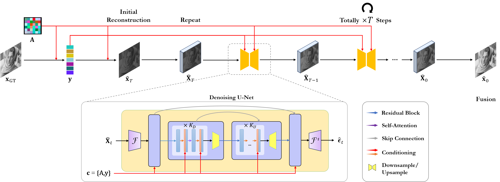

<div align=center><h1>
MSCD: Multi-Solution Collaborative Diffusion Model for Image Compressed Sensing
</h1>

其他语言: [[English](README.md)]

[](https://huggingface.co/Miyamura-Isumi/MSCD)


</div>

## 简介

一个多解协同的扩散重建模型，将图像压缩感知重建任务视为条件生成任务，构建多个可行解以丰富多样性。与现有方法相比，MSCD 实现了更优的重建质量。

## 总览



## 实验设置

### 环境要求

- Python ≥ 3.11
- CUDA ≥ 12.1

### 依赖

```shell
pip install -r requirements.txt
```

### 权重和数据集

从 [HuggingFace](https://huggingface.co/Miyamura-Isumi/MSCD) 获取 MSCD 训练和测试所需的数据集和模型权重，并按如下结构组织目录:

```
.
├── data/
├── weight/
├── MSCD/
└── README.md
```

## 运行

### 训练 MSCD

```shell
CUDA_VISIBLE_DEVICES=0,1 python -m torch.distributed.run --nproc_per_node=2 --master_port=23333 train.py --cs_ratio=0.1
```

### 测试 MSCD

```shell
CUDA_VISIBLE_DEVICES=0 python -u test.py --cs_ratio=0.1 --data_dir="data" --testset_name="Set11"
```
